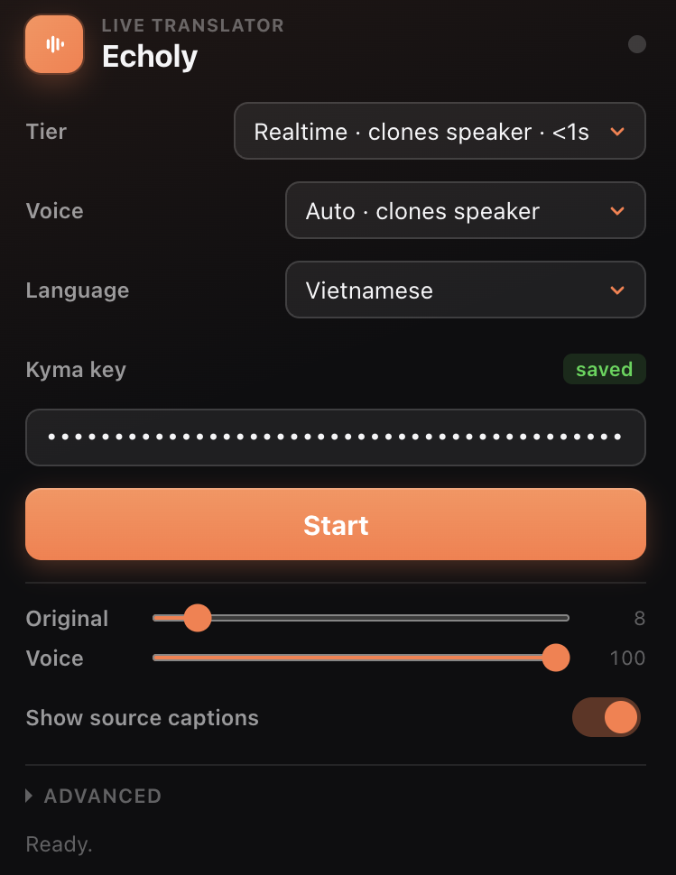

# Echoly — Live YouTube Translation

> Hear any YouTube video in your language. Live AI dubbing, runs on your own [Kyma](https://kymaapi.com) key.

<p align="center">
  
</p>

Chrome MV3 extension that overlays a live AI voice-over onto any YouTube video. Two tiers:

- **Realtime** — WebRTC P2P, sub-second lag, 9 OpenAI voices or auto-clone of the speaker. ~$0.46 / 10 min.
- **Standard** — chunked pipeline (Whisper → Gemini → MiniMax), ~5s lag, 5 curated multilingual voices. ~$0.25 / 10 min.

13 target languages. No account, no telemetry, no Echoly-operated server.

## Install

### From Chrome Web Store *(coming soon)*

The submission is in review at the Chrome Web Store. Once approved, install with one click.

### From source (developer mode)

1. Clone or download this repo
2. Open `chrome://extensions`
3. Toggle **Developer mode** (top-right)
4. Click **Load unpacked**
5. Select the cloned folder
6. Pin Echoly to the toolbar

Update with `git pull` and click the reload icon on the extension card.

## Use

1. Open any YouTube video
2. Click the Echoly icon
3. Paste your Kyma API key from [kymaapi.com](https://kymaapi.com)
4. Pick a tier, target language, and voice
5. Click **Start** — the dub plays and the on-page panel renders the live translation
6. Drag the panel by its toolbar; resize from any edge or corner

You can change voice or language mid-session — Realtime hot-swaps in <1s, Standard picks up the change on the next 5s chunk.

## How it works

```
popup ◄──BACKGROUND_STATE_UPDATE──── background ◄──CONTENT_STATE──── content (YT page)
       ───START / UPDATE_SETTINGS───►          ───CONTENT_START───►
```

- **popup.html / popup.js** — passive renderer, no own state.
- **background.js** — single source of truth for `state`. Injects content script via `chrome.scripting.executeScript` if not yet present.
- **content.js** — captures the YT video element audio, builds the in-page overlay panel, and runs the active pipeline:
  - **Realtime tier**: mints a Kyma ephemeral token, opens P2P WebRTC with OpenAI Realtime.
  - **Standard tier**: chunks the audio into 5s windows via `MediaRecorder`, re-encodes to WAV client-side, then runs Whisper transcription → Gemini translation → MiniMax TTS per chunk through the Kyma gateway. Web Audio scheduling queues the resulting mp3 chunks back-to-back.

Token-guarded async pattern (`pageToken` captured in closure, checked before any state mutation) keeps stale callbacks from corrupting newer sessions when the user changes settings or stops mid-pipeline. An `AbortController` per Standard session cancels in-flight fetches the moment Stop is clicked, so credits aren't burned on orphaned chunks.

## Features

- One-key onboarding (paste Kyma key → Start)
- 13 target languages: English, Vietnamese, Japanese, Korean, Chinese, French, Spanish, German, Portuguese, Hindi, Indonesian, Italian, Russian
- Drag/resize on-page overlay panel with persisted layout
- Translation history (last 16 turns, scrollable)
- Source caption rendering (toggle in popup)
- Independent volume sliders for original audio and dub
- Voice amplification up to 2× via Web Audio GainNode
- Instant pause/play (no reconnect)
- 60-min hard auto-stop with a one-shot 5-min warning
- Tab close cleanup via `keepalive` POST so Kyma sees the session end

## Standard tier voices

Curated from MiniMax's 333-voice catalog. All multilingual — each voice speaks any of the 13 target languages.

- **Magnetic Man** — US, male
- **Captivating Female** — US, female
- **Deep Voice Man** — US, male
- **Confident Woman** — US, female
- **News Anchor** — female

## Privacy

Echoly does not collect, store, or sell any personal data. Your Kyma API key stays on your own device. Audio is sent directly to AI providers (Kyma, and OpenAI for Realtime tier) for the sole purpose of producing the translation. There is no Echoly-operated server.

Full policy: [`store-assets/privacy-policy.html`](store-assets/privacy-policy.html)

## Build a release zip

```bash
./pack.sh
# → ~/echoly-vX.Y.Z.zip
```

Reads the version from `manifest.json`, excludes `.git`, `.DS_Store`, `node_modules`. Drop the resulting zip into the Chrome Web Store Developer Console for an update, or share it for manual sideload.

## Roadmap

- Per-tab session log (live cost meter)
- Language warming on hover (sub-200ms switches in Realtime)
- Dictionary lookup on highlighted source caption text
- Firefox port (MV3 manifest portability TBD)

## Contributing

Issues and PRs welcome. The codebase is plain vanilla JS — no build step, no dependencies. Pre-flight checklist before opening a PR:

- `node --check content.js && node --check background.js && node --check popup.js`
- Manual test in a freshly reloaded extension on at least one English YouTube video, both tiers
- If you touch `manifest.json`, bump the version and update both `manifest.json` and `content.js`'s `ECHOLY_VERSION` constant in lock-step

## License

[MIT](LICENSE) © 2026 Son Nguyen Tung
